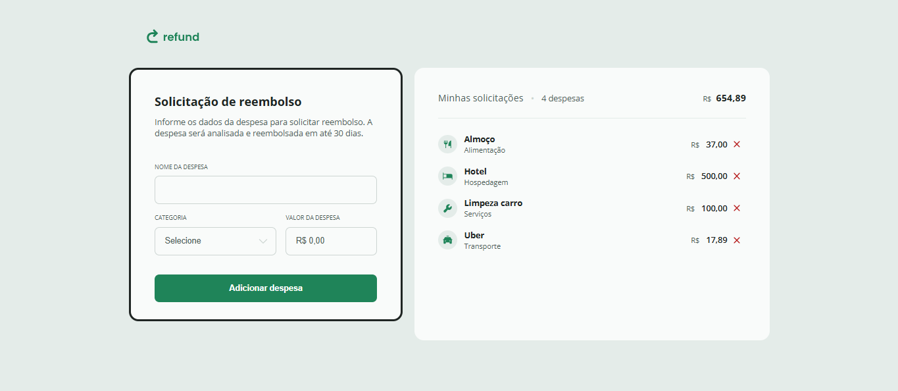

# 💰 Refund - Sistema de Solicitação de Reembolsos

**Aplicação web** para gerenciamento de solicitações de reembolso financeiro, desenvolvida com HTML, CSS e JavaScript.

## ✨ Funcionalidades Principais
- ✅ Formulário dinâmico para cadastro de despesas
- ✅ Cálculo automático de valores

## 🛠️ Tecnologias Utilizadas

  
  
  

## 🎨 Preview

  

## 🌐 Acesso

🔍 **Todos os meus projetos**: [github.com/luizacavalcantee](https://github.com/luizacavalcantee)

💌 **Contato**: cavalcanteluiza13@gmail.com | [LinkedIn](https://www.linkedin.com/in/luizacavalcanteee/)
